# 순서도
## 모양
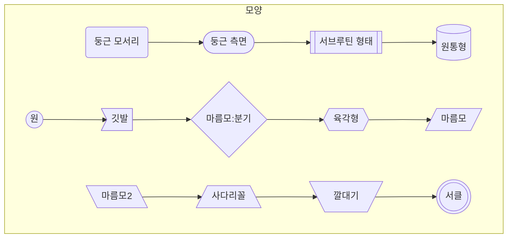

## 관계
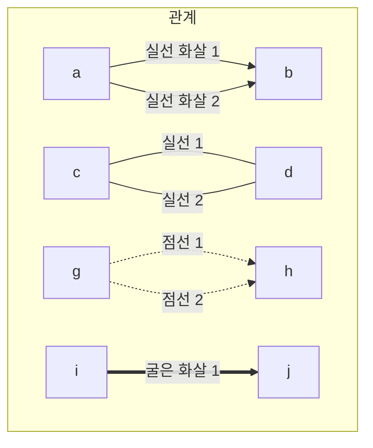

## 관계 연결
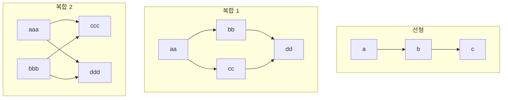

## 다방향 화살표  및 새로운 유형
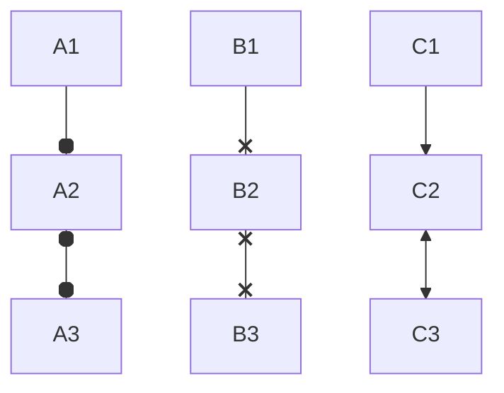

## 선 길이
| 길이에 따라 노선이 정해짐
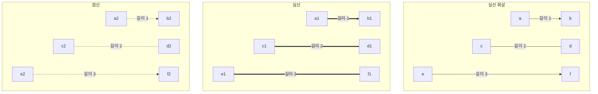

## 그룹 및 방향
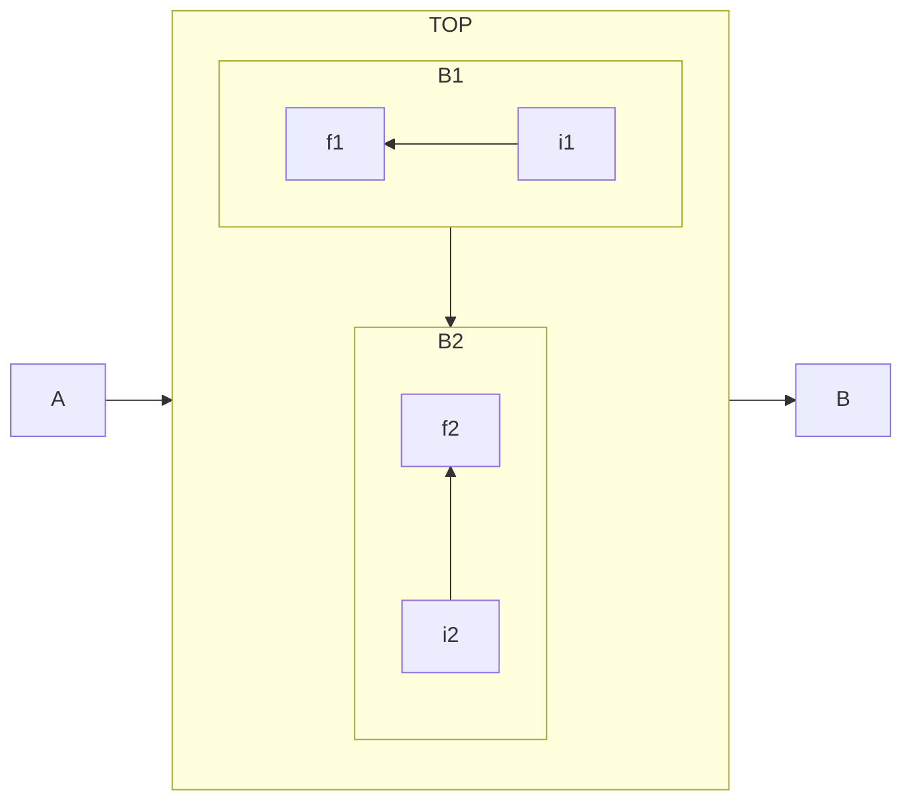

## 긴 문장 & 화살표 대체 & 스타일
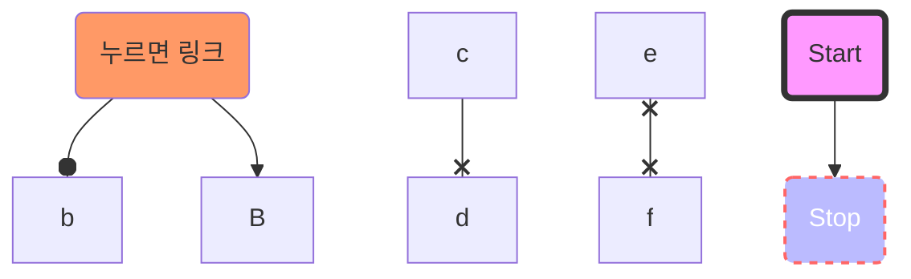
| 선언후에 사용할 수 있다.

# 시퀀스 관계 다이어그램
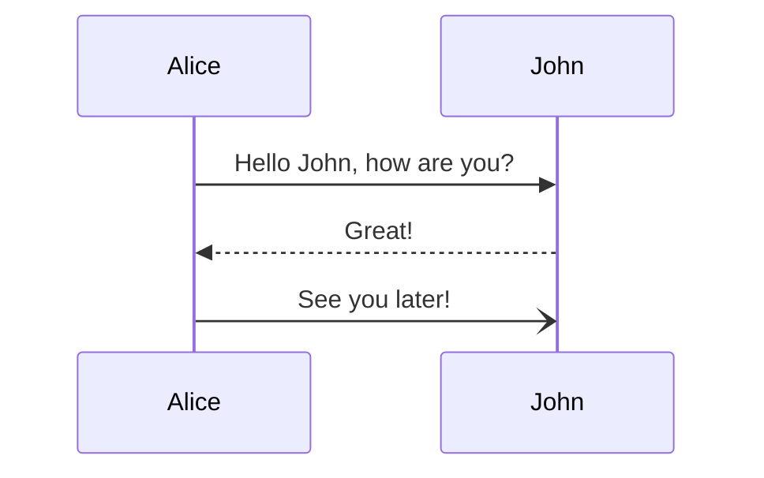

# 클래스 다이어그램
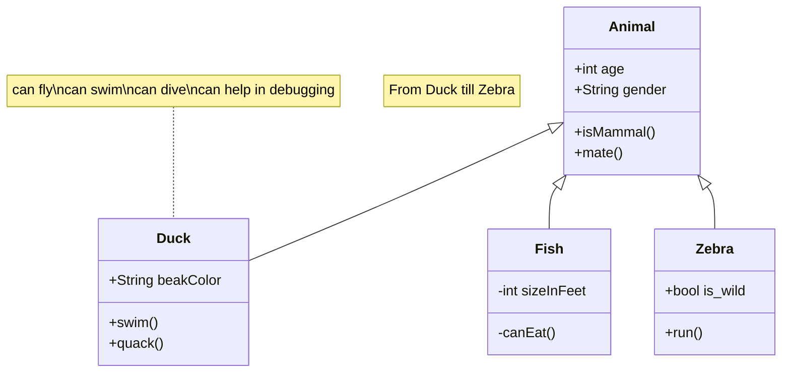
# 상태 다이어그램
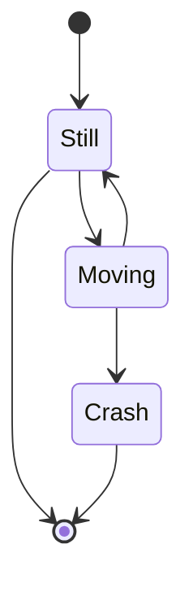

# 엔티티 관계 다이어그램
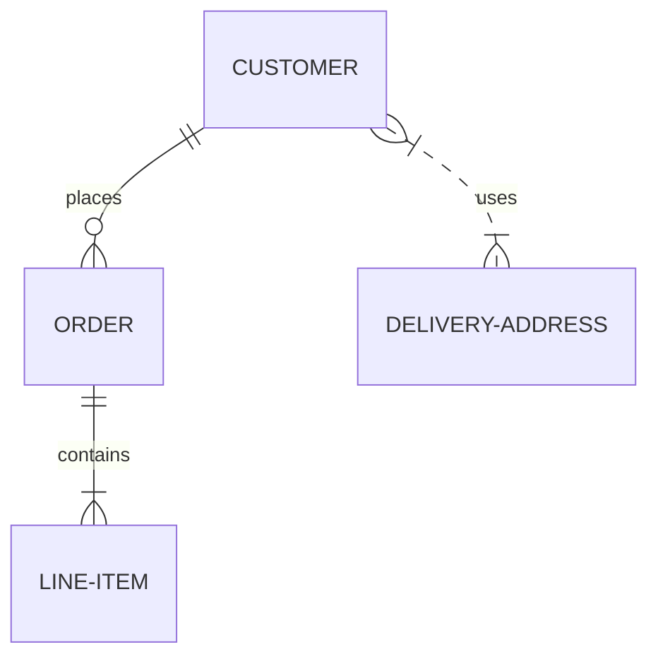

# 간트
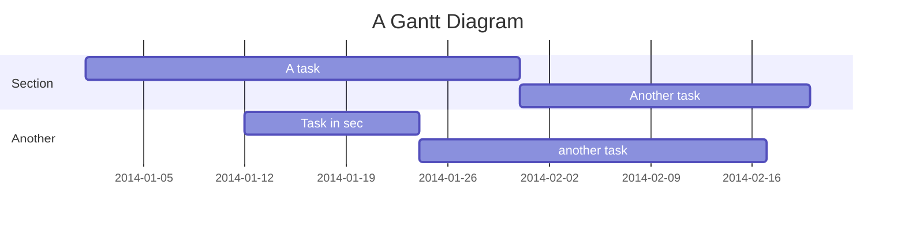

# 파이 차트
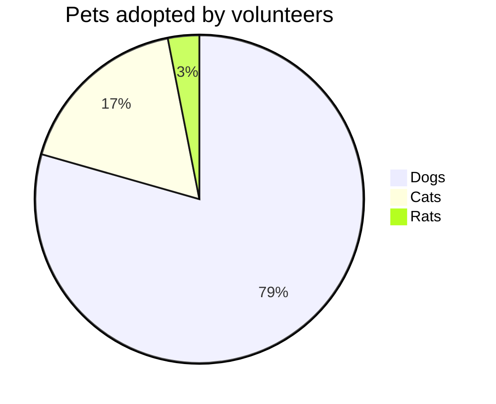

# 커밋 흐름도
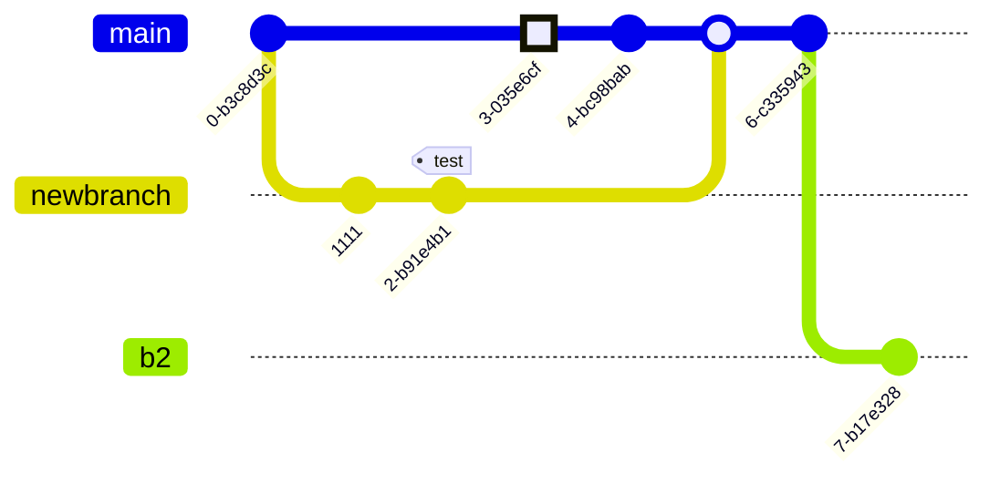