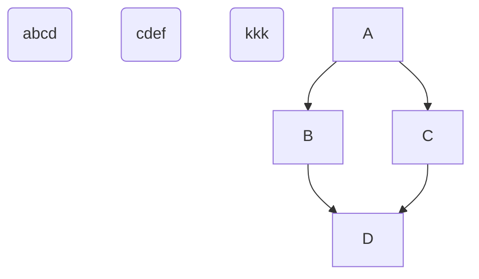

# 테스트 목록

## AutoTemplate 클래스
- [ ] extends (상속)
    + 상위 파일을 가져오는지
- [ ] cover
    + 상속된 파일 가져오기
    + cover -off : 상속하여 생성된 파일 제거 (수정파일은 유지)
- [ ] clear
    + publish, cover 파일의 삭제
- [ ] page(part)
- [ ] group(part) : all
- [ ] import
    + helper, data, part, page, group
- [ ] event
- [ ] overriding
    + src, data, part, page
- [ ] 초기화 : clear
- [ ] build

## TemplateSource 클래스

## CompileSource 클래스

## PageGroup 클래스

## AutoTask 클래스

## ETC
- [ ] 오토와의 연동
    + YY

